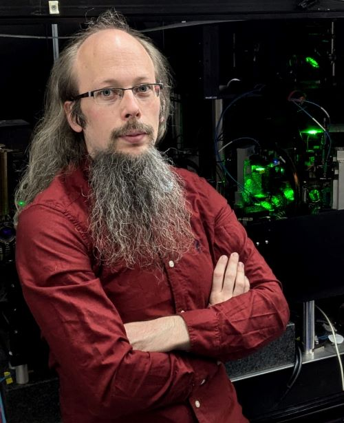

## Dr. Tobias Franzen (he/him)

I am an EPSRC Quantum Technologies Career acceleration fellow currently focusing on setting up a new experimental activity  on quantum networking between arrays of ytterbium qubits. The ultimate goal of this project is the realisation of a quantum network using standard telecom fibres to connect arrays of Yb atoms for applications ranging from sensing to quantum computing.

## Activities
|   |   | 
|:----:|----|
||[Telecom-wavelength quantum networking between arrays of Yb atoms](/research/tech/networking)  
||[CsYb: mixtures and molecules](https://www.cornishlabs.uk/csyb)   with Simon Cornish|---|

## Contact

* [tobias.franzen@durham.ac.uk](tobias.franzen@durham.ac.uk)

## Bio

Tobias Franzen earned his PhD from HHU Düsseldorf (Germany), where we worked on optical lattice clocks and on a new setup for investigations on ultracold Rb-Yb mixtures. He then joined Durham University to work with Simon Cornish on ultracold CsYb mixtures and molecules. Tobias has recently been awarded an EPSRC quantum technologies career acceleration fellowship to work on quantum networking between arrays of neutral ytterbium atoms. Outside of work he can be found working on his van, hill walking and attending metal concerts.

## Links
* [Telecom-wavelength quantum networking between arrays of Yb atoms](/research/tech/networking)
* [Google scholar](https://scholar.google.com/citations?user=_Doo0okAAAAJ&hl=en&oi=ao)
* [Durham University staff page](https://www.durham.ac.uk/staff/tobias-franzen/)

