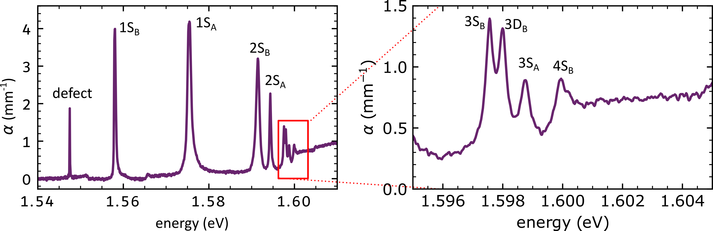
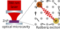

## Making photons interact with each other

Photons are incredibly good at transferring quantum information because they do not interact strongly with their environment. However, this lack of interaction is a double-edged sword, as it makes it difficult to perform operations in which one photon controls the state of another.

A long-standing goal in photonics is therefore to create a **strong optical nonlinearity at the level of a single photon** — a system in which the presence of one photon can significantly change the optical response of the material.

This new project explores whether **Rydberg excitons in zinc phosphide (ZnP2)** can provide a route towards this goal.

## A new material for Rydberg excitons

Rydberg excitons have previously been studied extensively in Cu2O, including here in [Durham](cu2o/). However, optical losses in Cu2O can make it challenging to use these states for photonics.

ZnP2 offers a promising alternative. It can support Rydberg excitons while exhibiting **50 times lower optical losses** than Cu2O. This means that light can interact with the Rydberg excitons for longer before being absorbed or scattered.

Shown below is our first exciton spectrum from ZnP2, currently showing excitons up to *n* = 4. Crucially, the background absorption that limits optical applications in Cu2O is not present.

## Rydberg exciton-polaritons

The next step is to place ZnP2 inside a **microcavity**.

A microcavity confines light between two mirrors, allowing photons to interact strongly with excitations in the material. When the coupling between light and an exciton becomes sufficiently strong, the two no longer behave as separate particles. Instead, they form hybrid light–matter states known as **polaritons**.

In our experiments, we will create a ZnP2 microcavity designed to strongly couple cavity photons to Rydberg excitons.

The low optical loss of ZnP2 is particularly important here. It allows us to create high-quality cavities, which in turn will allow high-*n* Rydberg states to be strongly coupled to light.

## From interacting excitons to interacting photons

The most exciting aspect of the project comes from the strong interactions between Rydberg excitons.

Two Rydberg excitons interact strongly with one another. If one exciton is excited, its presence can shift the energy of nearby Rydberg states and prevent another exciton from being excited within a certain radius. This phenomenon is known as the **Rydberg blockade**.

In a microcavity, this interaction can be transferred to the optical field, as the device will behave differently depending on whether one or two photons are incident on it. This could create a **single-photon optical nonlinearity**: a regime in which one photon can significantly change the behaviour of another.

## Why does this matter?

Strong optical nonlinearities at the single-photon level would open up exciting possibilities for quantum photonics.

For example, if one photon could control another, it could be possible to construct **photon–photon logic gates**, in which individual photons act as information carriers and control one another. Such interactions could also be used to generate **entangled states of light**, an important resource for quantum information processing.

## Interested in working on this research?

We are always interested in hearing from motivated students and researchers interested in working at the intersection of quantum optics, condensed matter physics, photonics, and quantum technology.

Contact [liam.a.gallagher@durham.ac.uk](mailto:liam.a.gallagher@durham.ac.uk) to find out more.

## Team

[Dr. Liam Gallagher](https://www.durham.ac.uk/staff/liam-a-gallagher/) (Principal Investigator)  

## Collaborators

This research is done in collaboration with:

[Professor Geetha Balakrishnan](https://warwick.ac.uk/fac/sci/physics/research/condensedmatt/supermag/whoswho/geetha_balakrishnan/) — University of Warwick — crystal growth

[Jacob Svane](https://www.au.dk/en/jsvane@chem.au.dk/) — University of Aarhus — crystal growth

[BAE Systems FAST Labs](https://www.baesystems.com/en/product/nonlinear-crystal-technologies) — crystal growth

[Dr. Hamid Ohadi](https://research-portal.st-andrews.ac.uk/en/persons/hamid-ohadi) - microcavity fabrication

## Funding

This research is supported by EPSRC through a **Quantum Technologies Career Acceleration Fellowship**, [UKRI1222](https://gtr.ukri.org/projects?ref=UKRI1222).
