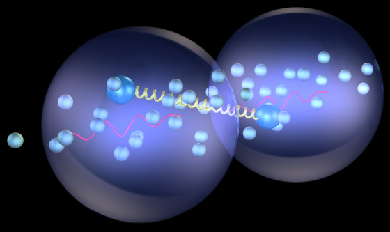
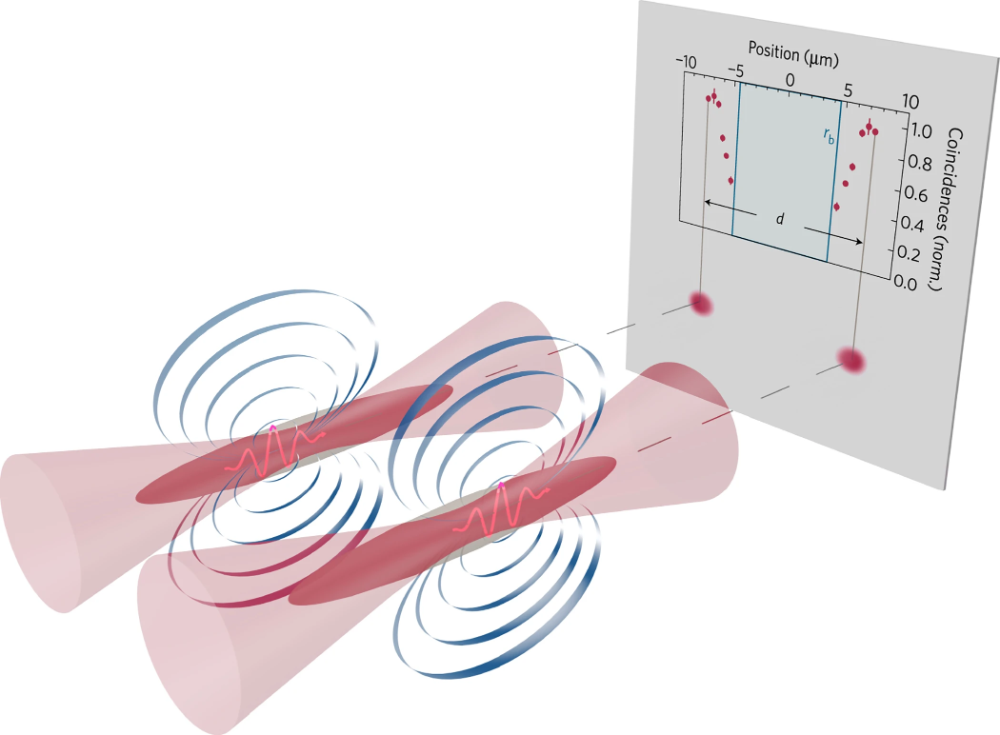
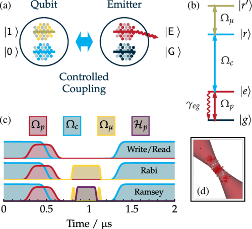
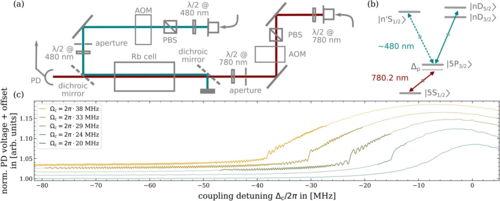
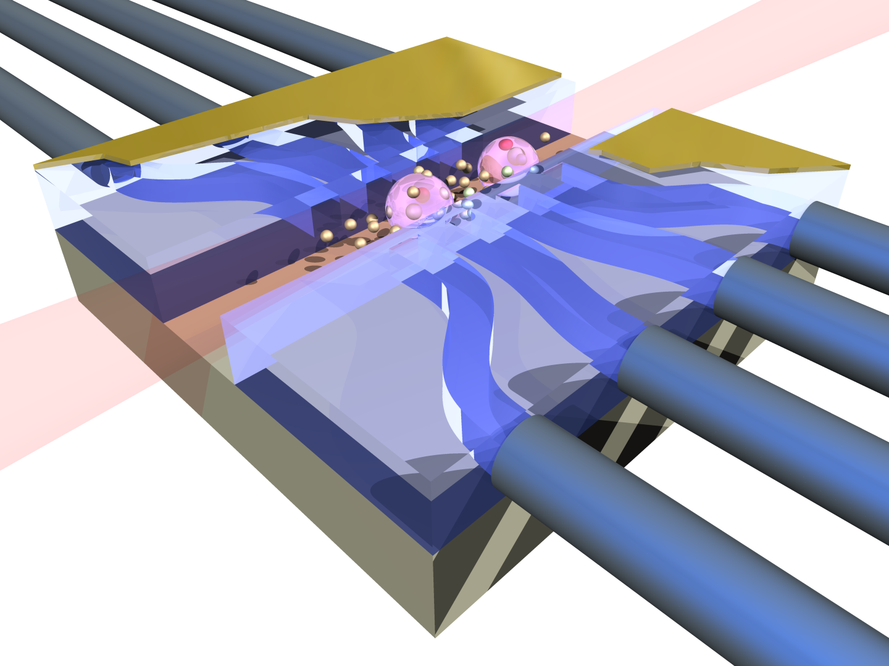

Our group is all about atoms, photons, and their properties. We are particularly curious about the interaction between photons and atoms, how to tailor the interactions to various applications and harness their special properties. As experimentalists, we conduct experiments in our labs at Durham University but our group also has a strong background in computational and theoretical quantum & atomic physics. As a team, we are a small group of kind and curious researchers immersed in the wider Quantum Light and Matter section at Durham Uni, and we are always welcoming new PhD students, postdocs or academic visitors. Please see our open positions at the bottom of the page and get in touch with Stuart Adams for any queries (c.s.adams@durham.ac.uk).

||
|:--:|
|Illustration of the interaction between two polaritons, i.e. quasiparticles made up of atoms and photons.|

 

## What We Do...
### ...and what we are curious about.
As experimentalists we conduct research on different platforms, recent research has included both hot vapour and ultracold atom experiments. However, all our work has two main ingredients in common: Rydberg atoms and photons. 

Rydberg atoms are highly excited atomic states with exaggerated and peculiar properties, such as strong interactions, sensitivity to electromagnetic fields, and a wide range of atomic transitions in the radiofrequency and THz spectrum. All of these are relevant to our experiments in one way or another.

The other key ingredient for our experiments are photons. We use them to either manipulate the atomic properties by adding nonlinearities to the atomic dynamics via Rydberg interactions, to induce state changes, or to imprint interactions on the photons by dressing them with matter. In the past, we have used single photons as well as high-power photonic fields, spanning the rf, THz and optical range.

### Manipulating the properties of photons...
Our past research includes the creation of contactless interactions between pairs of photons [Nature Physics **13**, 655-658 (2017)](https://www.nature.com/articles/nphys4058), which is difficult to achieve since photons do not interact with one another. We have therefore admixed the photons with matter in a quasiparticle called polariton, which inherits properties of photons and matter to a variable degree. When admixing Rydberg atomic states to the photons one also inherits the strong nonlinear interactions between Rydberg states, which then creates an effective interaction between photons! These interacting photons can be used in future applications such as quantum information processing or sensing. 

||
|:--:|
|Contactless nonlinear interactions between two photons that were mapped onto quasiparticles called polaritons. Taken from [Nature Physics **13**, 655-658 (2017)](https://www.nature.com/articles/nphys4058).|

Taking this one step further, we have shown that Rydberg polaritons can also be used to form the fundamental building blocks of a quantum computer, a so-called qubit [PRL **127**, 063604 (2021)](https://journals.aps.org/prl/abstract/10.1103/PhysRevLett.127.063604). We have shown that qubits based on Rydberg polaritons are robust against atom loss from the polaritonic mode, and provide a very convenient optical readout by simply mapping the polaritons back into photons. And as we already know from our previous work, these collective Rydberg qubits can interact via Rydberg-interactions mediated by the matter component of the polaritons. This gives us all the tools that we need to use Rydberg polaritons in applications. One avenue of our future research therefore is continuing to explore Rydberg polaritons for applications ranging from quantum information processing via tests from the foundations of quantum mechanics to applications in sensing. 

||
|:--:|
|Write sequence to create and manipulate a collectively encoded Rydberg qubit. Taken from [PRL **127**, 063604 (2021)](https://journals.aps.org/prl/abstract/10.1103/PhysRevLett.127.063604).|

 

### ...and the properties of atoms
More recently, our group has co-discovered the emergence of synchronisation in a strongly-driven hot Rydberg vapour [PRL **131**, 143002 (2023)](https://journals.aps.org/prl/pdf/10.1103/PhysRevLett.131.143002). We found that a hot Ryberg vapour can exhibit a transition to a state where the dynamics of the atoms in the vapour synchronise to a macroscopic, periodic response - in spite of continuous driving and strong disorder. This periodic response to continuous driving is indeed very unintuitive at first sight, but can be understood in the framework of nonlinear dynamics and bifurcation theory. It is an effect called synchronisation that is at play here, which occurs because the atomic dynamics in the vapour are not independent of each other but are coupled - and therefore also develop in unison rather than individually, once a certain threshold coupling strength between the atoms has been met. Synchronisation also underlies many phenomena in our natural world, such as fireflies flashing in unison. It is therefore particularly exciting to find this effect at work in our atomic systems as well!

||
|:--:| 
|Schematics of the setup (top left), the level scheme (top right) and sample data traces showing the emergence of a synchronisation region in the spectrum (bottom). Taken from [PRL **131**, 143002 (2023)](https://journals.aps.org/prl/pdf/10.1103/PhysRevLett.131.143002).|

 

## Do You Want To Join Us?

As one can see, we are interested in enhancing our understanding of the fundamentals of atom-photon interactions, but we always also have potential applications in mind. Our research is therefore very varied and versatile, group members have a certain freedom to explore their personal interests within the capabilities of the group. We are looking for people who are motivated to pursue their projects in a warm and welcoming group with a lot of background knowledge and expertise at hand. We welcome applications for PhD and postdoc positions (see below), and we particularly encourage members of marginalised and underrepresented groups to consider applying with us. Please get in touch with Stuart Adams (c.s.adams@durham.ac.uk), we are happy to answer your questions and get to know you!

 

### Rydberg quantum optics PhD studentship 

The goal of Rydberg quantum optics is to exploit the strong interactions between highly-excited Rydberg atoms to modify the properties of light at both the level of single photons and few photon coherent states. The applications are wide ranging from fast read-out of qubits in quantum computing to quantum optimisation problems like graph colouring, and complex system dynamics such a synchronisation and time crystals. 

The project is supported by funding from UKRI, Leverhulme and ESA. In addition, we benefit from an extended network of international collaborators. 

For further details please contact Stuart Adams (c.s.adams@durham.ac.uk)

||
|:--:| 
|The figure shows a fibre waveguide array coupling light in and out of an ensemble of ultra-cold atoms. The red laser excites some atoms to highly-excited Rydberg states (violet spheres) and thereby maps their strong interactions back onto the light.|

 

## Current Team Members

- [Stuart Adams](https://www.durham.ac.uk/staff/c-s-adams/) (PI)
- [Kevin Weatherill](https://www.durham.ac.uk/staff/k-j-weatherill/) (co-investigator)
- [Aaron Reinhard](https://www.kenyon.edu/directory/aaron-reinhard/) (Leverhulme Visiting Professor)
- [Lucy Downes](https://www.durham.ac.uk/staff/lucy-downes/) (PDRA)
- [Oliver Hughes](https://www.durham.ac.uk/staff/oliver-d-hughes/) (RA)
- [Karen Wadenpfuhl]() (PhD student)

 

## Selected Publications

1. K. Wadenpfuhl and C.S. Adams: *Emergence of Synchronization in a Driven-Dissipative Hot Rydberg Vapor*, [PRL **131**, 143002 (2023)](https://journals.aps.org/prl/pdf/10.1103/PhysRevLett.131.143002)
2. N.L.R. Spong, Y. Jiao, O.D.W. Hughes, K.J. Weatherill, I. Lesanovsky and C.S. Adams: *Collectively encoded Rydberg Qubit*, [PRL **127**, 063604 (2021)](https://journals.aps.org/prl/abstract/10.1103/PhysRevLett.127.063604)
3. H. Busche, P. Huillery, S.W. Ball, T. Ilieva, M.P.A. Jones, and C.S. Adams: *Contactless nonlinear optics mediated by long-range Rydberg interactions*, [Nature Physics **13**, 655-658 (2017)](https://www.nature.com/articles/nphys4058)
4. N. Sibalic, J.D. Pritchard, C.S. Adams and K.J. Weatherill: *ARC: An open-source library for calculating properties of alkali Rydberg atoms*, [Comp. Phys. Comm. **220**, 319-331 (2017)](https://www.sciencedirect.com/science/article/pii/S0010465517301972)
