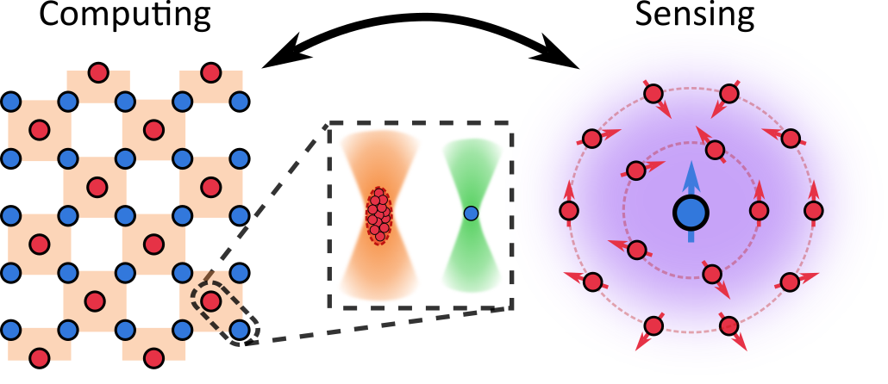

## Overview

We aim to create a dual-species tweezer array platform that allows atom-by-atom assembly of scalable quantum systems. By harnessing the complementary strengths of caesium and ytterbium, we will explore new architectures for quantum computing, sensing, and fundamental physics.

---

## Why?

Learning to control quantum effects such as superposition and entanglement opens the door to new, transformative technologies like quantum computers and quantum sensors. Optical tweezer arrays offer exquisite control over individual quantum systems, trapping single atoms at ultracold temperatures where they can be perfectly isolated from the environment. This allows us to create long-lived superpositions of atomic states and by exciting to Rydberg states we can engineer strong interactions between the atoms to entangle them. This approach has been very successful in realising programmable quantum systems of individual atoms for quantum computation, sensing and metrology.  

### Why two species?

Using two atomic species offers different capabilities. Single species systems face challenges because all the atoms are the same, making it hard to perform certain operations like manipulating or measuring a subset of atoms without effecting its neighbours. By using two species — caesium and ytterbium in our case — we gain independent control making the platform well-suited to applications where atoms must take on distinct roles such as: data and ancilla qubits in quantum error correction or as matter and gauge fields in quantum simulators. This flexibility also opens up new opportunities for quantum sensing and state preparation. 

---

## How?

We cool and trap caesium and ytterbium atoms to temperatures close to absolute zero using laser light and magnetic fields in a magneto-optical trap (MOT). From there, the ultracold atoms are transferred into optical tweezer arrays, created by focusing a grid of tightly focused laser beams onto the atoms. Each tweezer allows us to trap an individual atom. 

By controlling the position of these tweezers, we can arrange individual atoms into any geometry we need for a given experiment. O, combining this with the ability to move the traps around we can arrange the atoms in geometries we require for the experiment at hand. We use precisely tuned laser pulses to prepare the atoms in well-defined quantum states and excite them to Rydberg states, where they exhibit strong, controllable interactions. 

By combining this control with fast, high-fidelity measurements of the atoms’ quantum states, we aim to develop new ways of generating long-range quantum entanglement and explore how these entangled systems can be harnessed for future quantum technologies.

---

## Team

[Dr. Alex Guttridge](/members/current/guttridge) (Principal Investigator) 

[Mr. Colin Hung](https://www.durham.ac.uk/staff/colin-l-hung/) (PhD Student)

---

## Apply Now!
If you are interested in joining the team or finding out more, please contact [Dr. Alex Guttridge](mailto:alexander.guttridge@durham.ac.uk).

---

