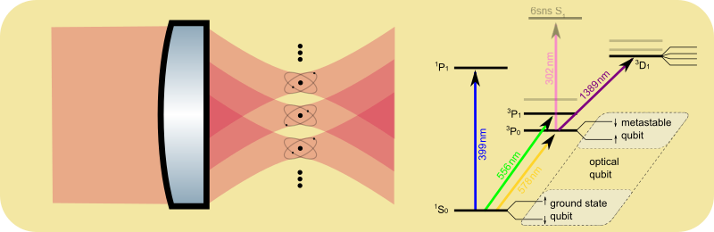
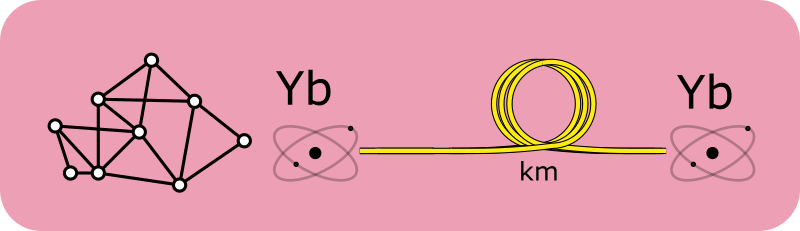

We are an experimental research group at Durham QLM with the goal of realising quantum networking between arrays of single ytterbium (Yb) atoms for applications ranging from quantum enhanced remote sensing to quantum computing.

## Arrays of single atoms

Single atoms are an ideal platform for the observation of quantum behaviour and for many applications in quantum technologies. Using extremely tightly focussed laser beams, so called optical tweezers, we can trap and manipulate single atoms in an ultra-high vacuum. This allows us to create arrays of many perfectly identical quantum systems, almost perfectly isolated from the environment.
 Additional laser beams and magnetic fields give us near perfect control over the motional and internal state of each atom.

The electronic structure of ytterbium (Yb) atoms makes this species particularly powerful:
 With a nuclear spin of ½ that is extremely well decoupled from the environment the isotope 171Yb is ideal for realising qubits, the basic building block of quantum information. The long-lived triplet states are ideal for laser cooling, precision measurements and form the basis of optical atomic clocks.

The combination of **o**ptical, **m**etastable and **g**round state qubits is known as the omg-architecture and provides a wealth of options for quantum computing, for example the implementation of qubits dedicated to storage and computation in the same species.
Finally, a telecom wavelength transition directly connecting to the metastable state is ideal for quantum networking.

## Quantum networking

A promising approach to scaling up quantum systems is through connecting several systems to form a larger, more powerful system - quantum networking.
However to maintain the quantum behaviour of the entire system, the connection between nodes needs to be quantum as well. This requires keeping interactions with the (classical) environment extremely low, while allowing strong interactions between the qubits and the connection - a formidable challenge, particularly for long connections. Fortunately, optical fibres that are already widely deployed for telecommunication make possible to transfer photons in the telecom wavelength range (1.3μm - 1.6μm) over tens and hundreds of kilometers with very low loss.

Our goal is to use such fibres to build networks between Yb atoms. By integrating arrays of single Yb atoms with tiny optical cavities formed on the ends of optical fibres, we address the challenge of creating strong interactions between our Yb qubits and photons travelling over long distances through the optical fibre. Our goals is to develop an interface that allows the transfer of quantum information between Yb atoms separated by km-scale distance. 

Possible applications of this technology include
* Quantum enhanced comparisons between remote atomic clocks
* Building more powerful quantum computers by connecting multiple quantum processing units in a network - just like today's classical supercomputers are built from many processing nodes

## Low SWaP systems

Quantum networking and many other quantum technologies become vastly more powerful the simpler and smaller we can make each individual device. Today many quantum science setups fill rooms and require several people to operate. We are thus particularly interested in ways to simplify and shrink our setups. 

For example the wavelengths required to work with Yb atoms so far have been a barrier to its more widespread adoption, requiring several different laser technologies, often lacking in robustness while filling several optical tables. We are working on streamlining this by developing modular rack-mounted systems with a single laser technology covering all required wavelengths.

## Team

|   |   | 
|----|----|
||[Dr. Tobias Franzen (he/him)](/members/current/franzen)  (PI)  [tobias.franzen@durham.ac.uk](tobias.franzen@durham.ac.uk)
|  |[Dr. Danielle Pizzey](https://www.durham.ac.uk/staff/danielle-boddy/)  (QLM Chief Experimental Officer)|  

## Join us

We have currently have a funded PhD student position for a 2026 start as well as a postdoc position available.
 If you are interested, please get in touch with [tobias.franzen@durham.ac.uk](tobias.franzen@durham.ac.uk). I'm looking forward to getting to know you and discussing details. 

## Collaborators

We work closely with collaborators in academia and industry:
* For the development of our micro-cavities we work with Matthias Keller and his [Ion Trap Cavity-QED and Molecular Physics
(ITCM) group](https://www.sussex.ac.uk/research/labs/ion-trap-cavity-qed-and-molecular-physics/) at Sussex University
*  To meet the high demands our experiments place on laser systems in a compact and robust package we work closely with laser manufacturer [Vexlum](https://vexlum.com/) (Finland)

## Funding

* EPSRC Quantum Technologies Career Acceleration Fellowship UKRI1227 'Quantum networking at telecom wavelengths with Yb qubits' (£1.7m)

